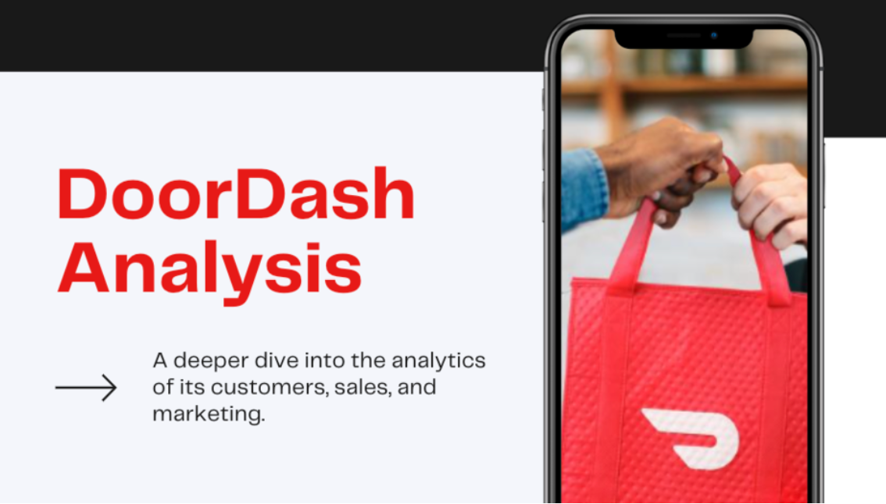
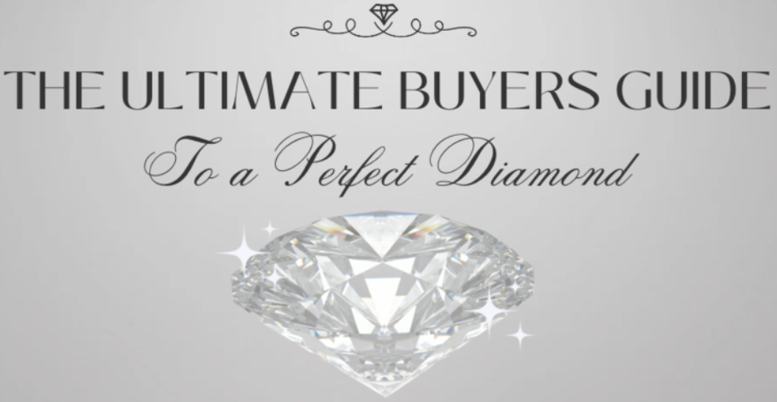

# Welcome to My Portfolio!

---

### Learn More About My Projects

#### [Door Dash Analysis](https://www.linkedin.com/pulse/doordash-analytics-catherine-gonzales/)

My very first project! In this project, I analyzed data from Door Dash, to better understand sales and customer patterns. I proposed business recommendations to increase overall sales.

---

#### [Education System Analysis](https://www.linkedin.com/pulse/deep-dive-massachusetts-education-system-how-schools-gonzales/)

For this project, I analyzed school data from the Massachusetts Education system to better understand school performance, graduation rates, and college attendance. I determined next steps for the superintendent of schools.

---

#### [Diamond Analysis](https://www.linkedin.com/pulse/4cs-buying-quality-diamond-catherine-gonzales%3FtrackingId=faM3EgY6R2WiHNFDqiO6%252Bw%253D%253D/?trackingId=faM3EgY6R2WiHNFDqiO6%2Bw%3D%3D)

For this project, I analyzed data from over 200,000 diamonds to guide a customer in selecting the perfect quality diamond. I used the four Cs; carat, cut, clarity, and color of a diamond to determine its value.

---

#### [Healthcare Analysis](https://www.linkedin.com/pulse/analysis-patient-health-information-catherine-gonzales%3FtrackingId=MDHIZeXPSLy7mGgcKAoelg%253D%253D/?trackingId=MDHIZeXPSLy7mGgcKAoelg%3D%3D)

For this project, I analyzed data from over 200,000 diamonds to guide a customer in selecting the perfect quality diamond. I used the four Cs; carat, cut, clarity, and color of a diamond to determine its value.

